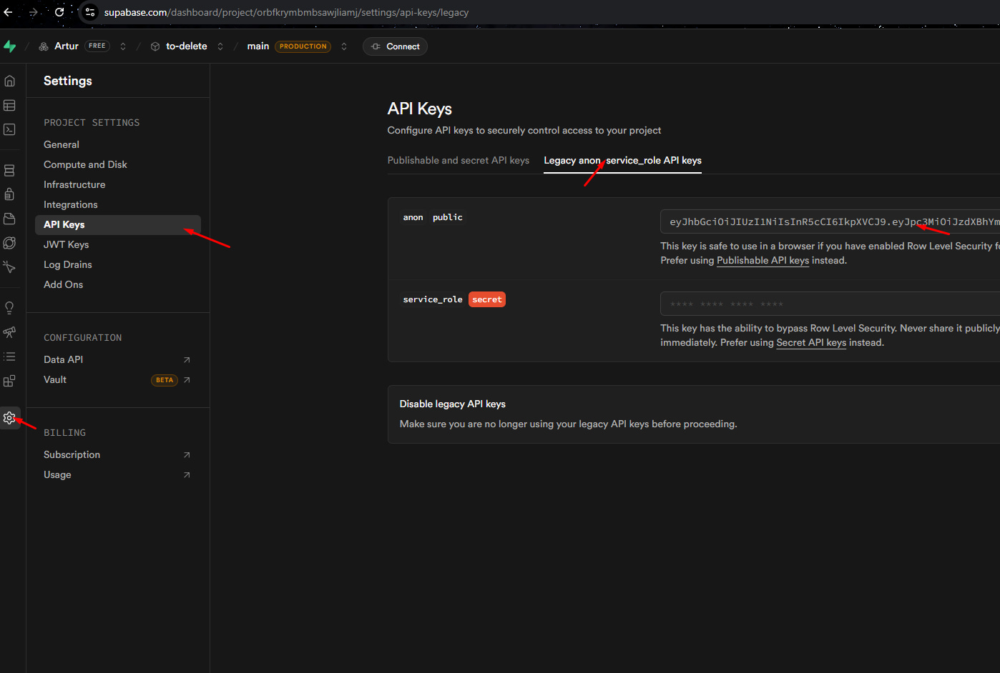

# BetterMe

Адмін-панель + клієнтський інтерфейс для доставки wellness-наборів дронами.

## Що потрібно

- Node.js 18+
- Docker
- Java 21 (якщо запускаєте бек без Docker)
- Акаунт на [Supabase](https://supabase.com)

## Supabase

1. Зареєструйтесь на [supabase.com](https://supabase.com)
2. Створіть новий проєкт, запам'ятайте пароль БД
3. Знайдіть три речі:

| Що           | Де шукати                                               |
| ------------ | ------------------------------------------------------- |
| Project URL  | Settings → API → Project URL                            |
| Anon Key     | Settings → API → `anon` `public` key (див. скрін нижче) |
| Database URL | Settings → Database → Connection string (URI)           |



## Бекенд

```bash
cd backend
```

Створіть `.env.properties`:

```properties
DATASOURCE_URL=jdbc:postgresql://aws-1-eu-west-1.pooler.supabase.com:6543/postgres
DATASOURCE_USERNAME=postgres.ВАШ_PROJECT_REF
DATASOURCE_PASSWORD=ВАШ_ПАРОЛЬ_БД
```

Запуск:

```bash
docker compose up -d
./gradlew bootRun
```

Бек буде на `http://localhost:8080`.

## Фронтенд

```bash
cd frontend
npm install
cp .env.example .env
```

Заповніть `.env`:

```env
VITE_SUPABASE_URL=https://xxxxx.supabase.co
VITE_SUPABASE_ANON_KEY=eyJ...ваш_ключ
VITE_API_URL=http://localhost:8080
```

> `VITE_API_URL` — адреса Spring бекенду

```bash
npm run dev
```

Відкрийте `http://localhost:5173`.

## Структура

```
frontend/src/
├── pages/
│   ├── Home.tsx          # Головна
│   ├── OrderPage.tsx     # Замовлення (карта + вибір набору)
│   ├── TrackPage.tsx     # Відстеження
│   └── admin/
│       ├── Login.tsx     # Вхід в адмінку
│       └── Dashboard.tsx # Таблиця замовлень
├── context/              # Auth, i18n, тема, тости
├── services/api.ts       # Клієнт до Spring API
└── client.ts             # Supabase клієнт
```

## Стек

|             |                                                    |
| ----------- | -------------------------------------------------- |
| Фронт       | React 19, Vite, TypeScript, Tailwind v4, shadcn/ui |
| Карти       | Leaflet, OpenStreetMap, Nominatim                  |
| Авторизація | Supabase Auth (JWT)                                |
| Бек         | Spring Boot, Java 21, Gradle                       |
| БД          | PostgreSQL (Supabase)                              |

## Рішення та припущення

- Авторизація через Supabase Auth. Бек може перевіряти JWT токени Supabase.
- Геокодинг через Nominatim (OpenStreetMap) — безкоштовно, без API ключа.
- Типи наборів: Default, Default+, Silver, Silver+, Gold, Gold+, Platinum, Platinum+.
- Адмінка на `/admin`, клієнтська частина на `/`.